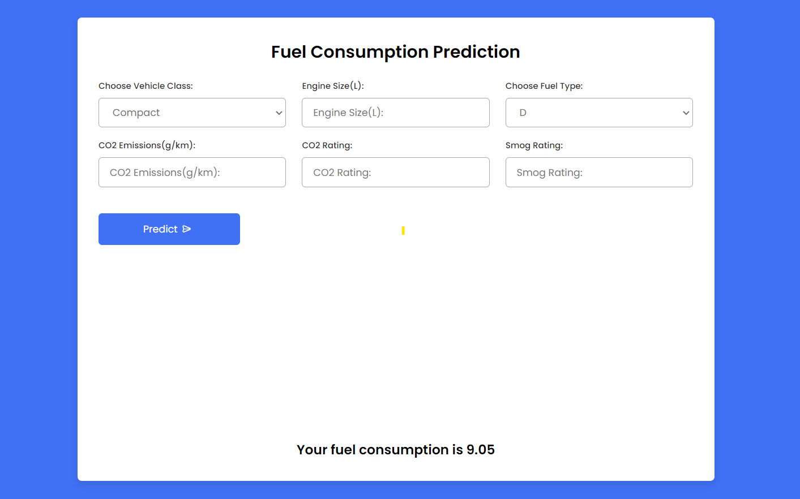
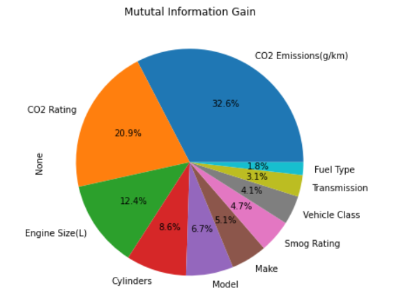
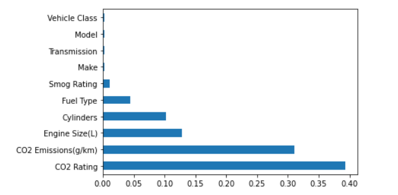

# Fuel Consumption Rating Regressor

This project utilizes Flask and Machine Learning to predict fuel consumption based on given parameters. It provides a web interface where users can input relevant details, such as vehicle specifications, engine size, and fuel type, to obtain an estimate of fuel consumption.

 
 

## Table of Contents

 - Metadata
 - Screenshot
 - Installation
 - Project Steps
 - About Me

 
 

## Metadata:
Given dataset contain 2022 Fuel Consumption Ratings information.
 Features             | Description                                                                |
| ----------------- | ------------------------------------------------------------------ |
| Model Year |Represent the year in which a particular model of a vehicle was produced. |
| Make | It describe the brand or manufacturer of a vehicle. |
| Model | It refers to a specific version of a vehicle produced by a manufacturer under a particular make or brand.|
| Vehicle Class |Represent the categorization system used in the automotive industry to group vehicles based on their size, body style, and intended use.|
| Engine Size | It tells us about the total volume of air and fuel that can be drawn into the engine cylinders of a vehicle's engine during one complete cycle. It is typically measured in either cubic centimeters (cc) or liters (L).|
| Cylinders|It refers to the individual chambers within a vehicle's engine where the combustion process takes place..|
| Transmission|It represents the system in which power transmission take place, from the engine to the wheels, which allowing the vehicle to move forward or backward.|
| Fuel Type| It refers to the specific type of fuel that is used to power a vehicle, machine, or other device. Z= Premium gasoline D= Diesel  E= Ethanol  X=Regular gasoline|
| Fuel Consumption(City (L/100 km)| It represents fuel consumption in the city.|
| Fuel Consumption(Hwy (L/100 km)|It represents fuel consumption on the Highway.|
| Fuel Consumption(Comb (L/100 km)|It represents fuel consumption for both city and highway.|
| Fuel Consumption(Comb (mpg))|It represents fuel consumption for both city & highway, in miles per imperial gallon(mpg).|
| CO2 Emissions(g/km)|It refer to the amount of CO2 that is emitted by a vehicle for every kilometer that it is driven.|
| CO2 Rating|It's measure a vehicle's carbon dioxide (CO2) emissions, typically expressed in grams of CO2 per kilometer(g/km).|
| Smog Rating|It's measure a vehicle's emissions of pollutants that contribute to the formation of smog.|

 
 

## Screenshot

 
 

## Installation

To set up the project locally, follow these steps:

    1. Clone the repository:

            git clone https://github.com/Supriyam-Mishra/Fuel-Consumption-Ratings-Regression.git

    2. Install the required dependencies:

            pip install -r requirements.txt

    3. Run app.py file

            python app.py

 
 

## Project Steps:

 

####   
#### <strong> Data Cleaning and Transformation : </strong> Handling the null values and noise in the dataset was taken care properly.
 

#### <strong> Feature Selection : </strong> Several methods were employed to select the most relevant features for the fuel consumption prediction task. These methods help to reduce dimensionality, enhance model performance, and identify the most informative features. The following are the methods that were followed for feature selection
- Dropping Constant Feature- In the dataset used for this project, the model year was a constant feature with a value of '2022'. Even though it was the only feature in the dataset with a constant value, a technique called VarianceThreshold was still employed to identify and handle such constant features.
The VarianceThreshold method is typically used to remove features with low variance, which often indicates that the feature has little or no predictive power. In this case, even though the model year feature had a constant value, applying the VarianceThreshold technique helped to identify and handle it accordingly. This step ensured that the model training process and subsequent predictions were not affected by this feature with a single value.
By using VarianceThreshold, the project effectively eliminated the constant feature, allowing the machine learning model to focus on other relevant features that provided valuable information for predicting fuel consumption. This preprocessing step enhanced the accuracy and performance of the model.

- With Correlation- During the analysis of the dataset, it was discovered that the columns 'Fuel Consumption (City)', 'Fuel Consumption (Highway)', and 'Fuel Consumption (Combined)' had a high correlation with the target variable. Since these three columns contained the same information and were highly correlated, they were dropped from the dataset to eliminate redundancy.
Additionally, an observation revealed an inverse correlation between the columns 'CO2 Rating' and 'CO2 Emissions (g/km)'. On the other hand, the columns 'Cylinders' and 'Engine Size (L)' exhibited a high correlation with each other. These insights into the correlation between different columns are important for understanding the relationships between variables in the dataset.
By identifying and handling these correlations, the project ensured that the model training process focused on the most relevant and independent features. This helped to improve the accuracy and reliability of the fuel consumption predictions.

- Fisher Score (Chisquare Test For Feature Selection)- According to the Fisher Score (Chi-square Test for Feature Selection) analysis performed, the 'Vehicle Class' column was found to be the most important column when compared to the output feature 'Fuel Consumption (Combined)'. The Fisher Score is a statistical measure used to evaluate the relevance and discriminatory power of features in a dataset.
In this analysis, the 'Vehicle Class' column demonstrated a strong association with the target feature, indicating that it contains valuable information for predicting fuel consumption. The Fisher Score highlighted the significance of this column in relation to the 'Fuel Consumption (Combined)' output.
By identifying the importance of the 'Vehicle Class' column, the project acknowledged its impact on fuel consumption predictions. This information can be leveraged to develop more accurate and effective models for estimating fuel consumption based on the vehicle's class.

- Feature Selection using Information gain (mutual_info_regression)- During the feature selection process using Mutual Information in Regression, the importance of each feature was determined. The following list presents the importance scores for each feature:

                | -------------------- | ---------  |
                |CO2 Emissions(g/km)   | 2.075765   |
                |CO2 Rating            | 1.330716   |
                |Engine Size(L)        | 0.790594   |
                |Cylinders             | 0.547070   |
                |Model                 | 0.428056   |
                |Make                  | 0.325356   |
                |Smog Rating           | 0.297225   |
                |Vehicle Class         | 0.261355   |
                |Transmission          | 0.196185   |
                |Fuel Type             | 0.116205   |

- ExtraTreesRegressor- The following result shows the importance of each feature according to ExtraTreesRegressor.

 

#### <strong> Model Building : </strong> Various models, including Linear Regression, Decision Tree, and Random Forest, were employed to predict fuel consumption. After evaluating the performance of these models, it was determined that the Decision Tree model outperformed the others and emerged as the best model for the task. 
The performance evaluation was based on various metrics such as accuracy, mean squared error, or R-squared. The Decision Tree model demonstrated superior performance in terms of its ability to capture the underlying patterns and relationships within the data, leading to more accurate fuel consumption predictions compared to the other models.
By identifying the best-performing model, the project was able to select an optimal solution for fuel consumption prediction, ensuring reliable and precise estimations.

 

#### <strong> Enhancing Performance : </strong> Initially, the Random Forest model was identified as the best performer in predicting fuel consumption. However, it was observed that the model was prone to overfitting, which could lead to poor generalization on unseen data. To address this issue, several techniques were applied to improve the model's performance.
Hyperparameter tuning was employed to optimize the parameters of the Random Forest model. By systematically adjusting the hyperparameters, such as the number of estimators, maximum depth, and minimum samples per leaf, the model's performance was fine-tuned to strike a balance between bias and variance.
Despite these efforts, it was found that the Decision Tree model consistently outperformed the Random Forest model even after hyperparameter tuning and cross-validation. The Decision Tree model demonstrated superior predictive power and generalization ability, making it the preferred choice for fuel consumption prediction in this specific scenario.
By identifying the best-performing model and employing strategies to enhance its performance, the project ensured accurate and reliable fuel consumption predictions.

 

#### <strong>  Deployment : </strong>The deployment of the project was carried out using the Decision Tree model, along with the utilization of pickle and Flask. This approach enabled the creation of an interactive interface for the project.
After selecting the Decision Tree model as the best-performing model for fuel consumption prediction, it was serialized using the pickle library. Serialization allowed the model to be stored as a binary file, preserving its state and structure.
Flask, a web framework, was then employed to develop the deployment infrastructure. Flask provided the necessary functionality to handle HTTP requests and responses, enabling the creation of a web-based interface.
Through this deployment setup, users were able to interact with the project by accessing the web interface. They could input the required parameters, such as vehicle specifications and driving conditions, and obtain real-time predictions of fuel consumption based on the trained Decision Tree model.
This deployment approach, leveraging the Decision Tree model, pickle serialization, and Flask web framework, provided an accessible and user-friendly interface for fuel consumption prediction. Users could conveniently access the project's functionalities and obtain accurate predictions for their specific scenarios.

 
 

# Hi, I'm Supriyam Mishra! 👋

## 🚀 About Me
I'm a Data Analyst Enthusiast, have honed my skills in data analysis, visualization,
and machine learning. With hands-on experience in Python, SQL, Excel, and PowerBI, 
I am proficient in extracting insights and delivering data-driven solutions. My 
passion for data-driven decision making and problem-solving is evident in my work. 

## 🔗 Links

## 🛠 Skills
Excel (Knowledge of Lookups, Pivot Tables, Pivot
charts and Dashboard),
Python (Knowledge of EDA and libraries like Pandas,
Numpy, Matplotlib),
SQL (Knowledge of Database principles, Joins, Subqueries, Aggregate functions, Unions),
PowerBI (Analytical & Visualization Skills, Designing
interactive charts, graphs, plots and dashboards),
Machine Learning (Basics of Machine Learning, EDA,
Data wrangling, Model training, Regression,
Classification)

                                        